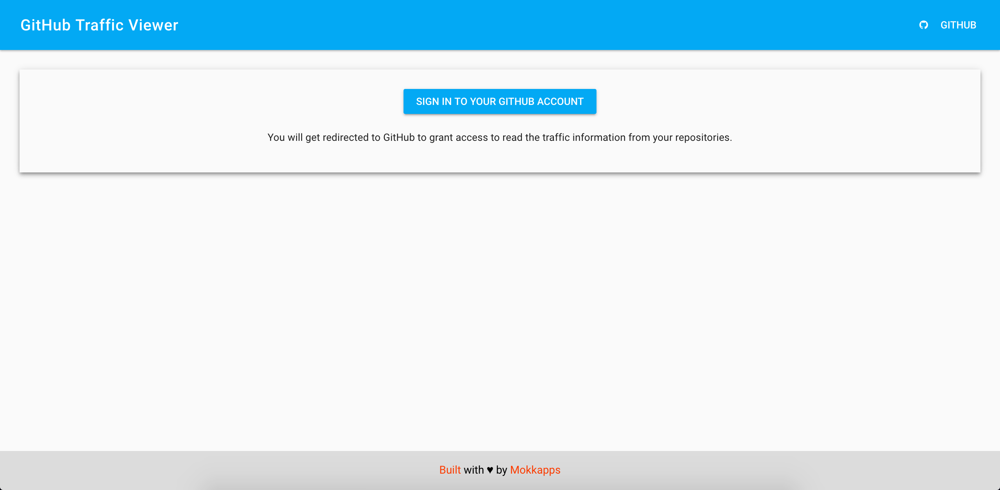

I have recently developed some static websites based on [GatsbyJS](https://gatsbyjs.org) which have a sticky footer. A sticky footer is always positioned on the bottom of the page, even for sparse content.

Unfortunately, I had some struggle to solve this and I, therefore, want to share my learnings with you.

## Non-GatsbyJS solution

In a traditional HTML, CSS, JavaScript application we can use [different ways](https://css-tricks.com/couple-takes-sticky-footer/) to implement such a fixed footer but I prefer the [Flexbox solution of Philip Walton](https://philipwalton.github.io/solved-by-flexbox/demos/sticky-footer/).

Flexbox provides a nice solution for the sticky footer problem. It can be used to layout content in horizontal and vertical direction. So we just need to wrap the vertical sections (header, content, footer) in a flex container and choose which one should expand. In our case, we want the content to automatically take up all the available space in the container.

Following, you can see his solution:

```html
<body class="site">
  <header>…</header>
  <main class="site-content">…</main>
  <footer>…</footer>
</body>
```

The corresponding CSS classes:

```css
.site {
  display: flex;
  min-height: 100vh;
  flex-direction: column;
}

.site-content {
  flex: 1;
}
```

Take a look at the [live demo](https://philipwalton.github.io/solved-by-flexbox/demos/sticky-footer/).

## GatsbyJS solution

GatsbyJS is based on React and we, therefore, have to think different.

The basic `layout.js` file from the [official GatsbyJS default starter](https://github.com/gatsbyjs/gatsby-starter-default) has a similar structure like the following example:

```js
const Layout = ({ children }) => (
  <StaticQuery
    query={graphql`
      query SiteTitleQuery {
        site {
          siteMetadata {
            title
          }
        }
      }
    `}
    render={data => (
      <>
        <Helmet
          title={data.site.siteMetadata.title}
          meta={[
            { name: 'description', content: 'Sample' },
            { name: 'keywords', content: 'sample, something' },
          ]}
        >
          <html lang="en" />
        </Helmet>
        <Header siteTitle={data.site.siteMetadata.title} />
        <div>{children}</div>
        <Footer />
      </>
    )}
  />
);

export default Layout;
```

So if we would style `<body></body>` and the `<div>{children}</div>` as proposed in [Philip Walton's solution](https://philipwalton.github.io/solved-by-flexbox/demos/sticky-footer/) it would not work.

But why? Because it would mean that the `<Footer/>` component has to be a direct children of the `<body>` tag which it isn't due to GatsbyJS's and React's way to build the HTML document.

To solve the problem I added a new `<div></div>` tag which should represent the `<body>` tag of the above mentioned example.

So my `layout.js` looks this way:

```js
const Layout = ({ children }) => (
  <StaticQuery
    query={graphql`
      query SiteTitleQuery {
        site {
          siteMetadata {
            title
          }
        }
      }
    `}
    render={data => (
      <>
        <Helmet
          title={data.site.siteMetadata.title}
          meta={[
            { name: 'description', content: 'Sample' },
            { name: 'keywords', content: 'sample, something' },
          ]}
        >
          <html lang="en" />
        </Helmet>
        <div className="site">
          <Header siteTitle={data.site.siteMetadata.title} />
          <div className="site-content">{children}</div>
          <Footer />
        </div>
      </>
    )}
  />
);

export default Layout;
```

The CSS:

```css
.site {
  display: flex;
  min-height: 100vh;
  flex-direction: column;
}

.site-content {
  flex-grow: 1;
}
```

You can see a working example on my [GitHub Traffic Viewer website](https://github-traffic-viewer.netlify.com/). The first page shows a spare content but the footer is stuck to the bottom. If you sign in and see the result list, the footer is also shown on the bottom of the page.



I hope this post is also helpful for you if you try to implement a sticky footer in a GatsbyJS website. 

Happy Coding!
