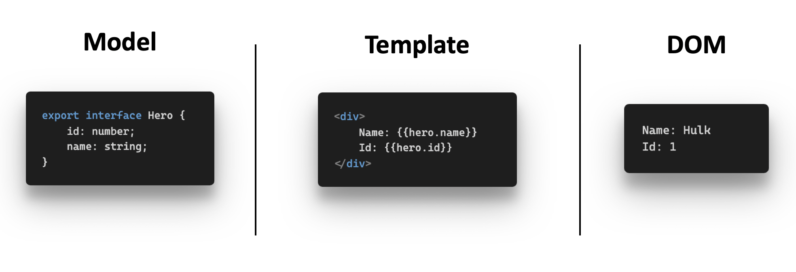
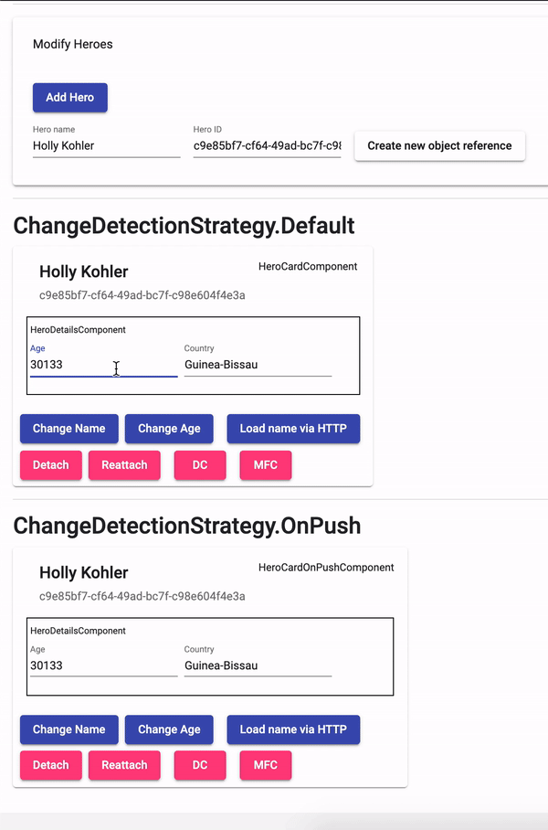
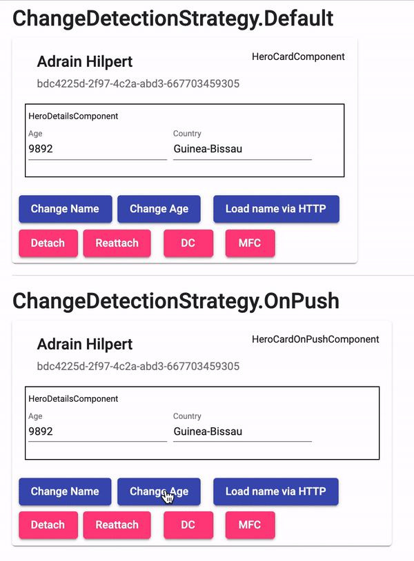
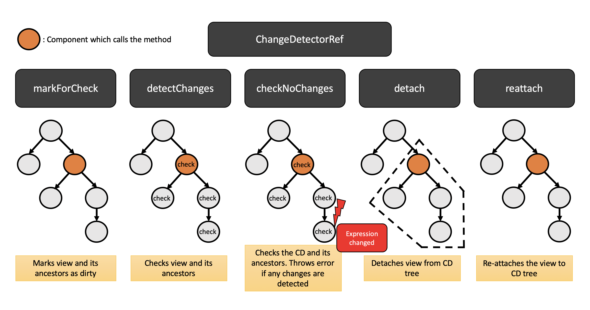
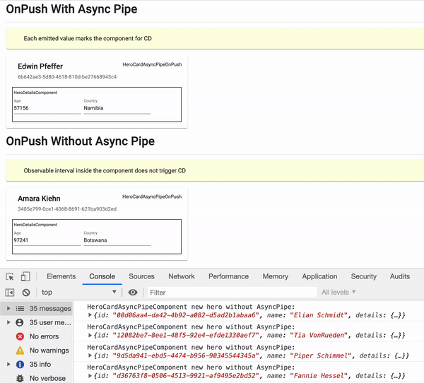
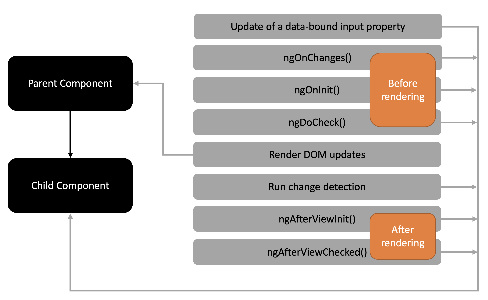
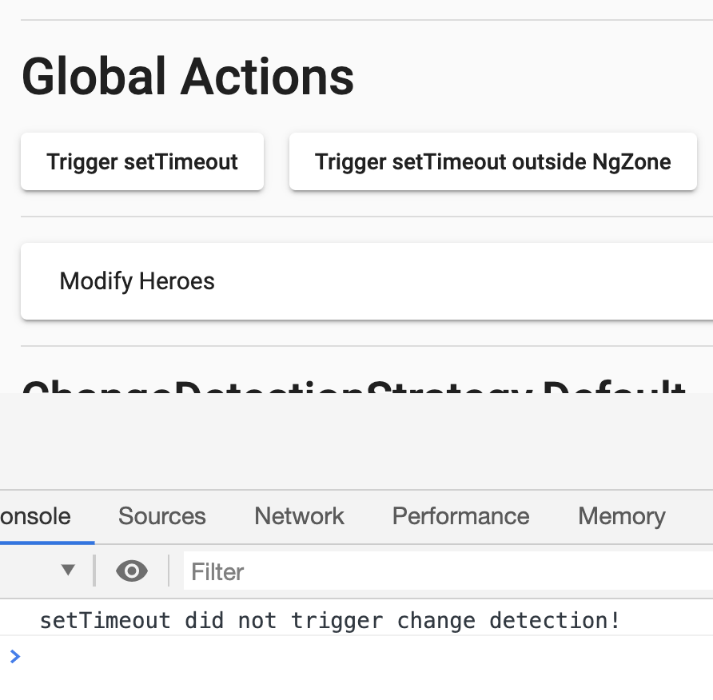

<!-- Variables -->
[demo-live]: https://angular-change-detection-demo.netlify.com
[demo-simple]: https://angular-change-detection-demo.netlify.com/simple-demo
[demo-async]: https://angular-change-detection-demo.netlify.com/async-pipe-demo
[demo-expression-changed]: https://angular-change-detection-demo.netlify.com/expression-changed-demo
[demo-github]: https://github.com/Mokkapps/angular-change-detection-demo

Angular's Change Detection is a core mechanic of the framework but (at least from my experience) it is very hard to understand. Unfortunately, there exists no official guide on the [official website](https://angular.io/) about this topic. 

In this blog post, I will provide you all the necessary information you need to know about change detection. I will explain the mechanics by using a [demo project][demo-github] I built for this blog post.

## What Is Change Detection

Two of Angular's main goals are to be predictable and performant. The framework needs to replicate the state of our application on the UI by combining the state and the template:



It is also necessary to update the view if any changes happen to the state. This mechanism of syncing the HTML with our data is called "Change Detection". Each frontend framework uses its implementation, e.g. React uses Virtual DOM, Angular uses change detection and so on. I can recommend the article [Change And Its Detection In JavaScript Frameworks ](https://teropa.info/blog/2015/03/02/change-and-its-detection-in-javascript-frameworks.html) which gives a good general overview of this topic.

> Change Detection: The process of updating the view (DOM) when the data has changed

As developers, most of the time we do not need to care about change detection until we need to optimize the performance of our application. Change detection can decrease performance in larger applications if it is not handled correctly.

## How Change Detection Works

A change detection cycle can be split into two parts: 

* **Developer** updates the application model
* **Angular** syncs the updated model in the view by re-rendering it

Let us take a more detailed look at this process:

1. Developer updates the data model, e.g. by updating a component binding
2. Angular detects the change
3. Change detection checks **every** component in the component tree from top to bottom to see if the corresponding model has changed
4. If there is a new value, it will update the component’s view (DOM)

The following GIF demonstrates this process in a simplified way:


The picture shows an Angular component tree and its change detector (CD) for each component which is created during the application bootstrap process. This detector compares the current value with the previous value of the property. If the value has changed it will set `isChanged` to true. Check out [the implementation in the framework code](https://github.com/angular/angular/blob/885f1af509eb7d9ee049349a2fe5565282fbfefb/packages/core/src/util/comparison.ts#L13) which is just a `===` comparison with special handling for `NaN`.

> Change Detection does not perform a deep object comparison, it only compares the previous and current value of properties used by the template

### Zone.js

In general, a zone can keep track and intercept any asynchronous tasks. 

A zone normally has these phases:
* it starts stable
* it becomes unstable if tasks run in the zone
* it becomes stable again if the tasks completed

Angular patches several low-level browser APIs at startup to be able to detect changes in the application. This is done using [zone.js](https://github.com/angular/angular/tree/master/packages/zone.js) which patches APIs such as `EventEmitter`, DOM event listeners, `XMLHttpRequest`, `fs` API in Node.js [and more](https://github.com/angular/angular/blob/master/packages/zone.js/STANDARD-APIS.md).

In short, the framework will trigger a change detection if one of the following events occurs:

* any browser event (click, keyup, etc.)
* `setInterval()` and `setTimeout()`
* HTTP requests via `XMLHttpRequest`

Angular uses its zone called `NgZone`. There exists only one `NgZone` and change detection is only triggered for async operations triggered in this zone. 

## Performance

> By default, Angular Change Detection checks for **all components from top to bottom** if a template value has changed.

Angular is very fast doing change detection for every single component as it can perform thousands of checks during milliseconds using [inline-caching](http://mrale.ph/blog/2012/06/03/explaining-js-vms-in-js-inline-caches.html) which produces VM-optimized code.

If you want to have a deeper explanation of this topic I would recommend to watch [Victor Savkin’s](https://twitter.com/victorsavkin) talk on [Change Detection Reinvented](https://www.youtube.com/watch?v=jvKGQSFQf10).

Although Angular does a lot of optimizations behind the scenes the performance can still drop on larger applications. In the next chapter, you will learn how to actively improve Angular performance by using a different change detection strategy.

### Change Detection Strategies

Angular provides two strategies to run change detections:
* `Default`
* `OnPush`

Let's look at each of these change detection strategies.

#### Default Change Detection Strategy

By default, Angular uses the `ChangeDetectionStrategy.Default` change detection strategy. This default strategy checks every component in the component tree from top to bottom every time an event triggers change detection (like user event, timer, XHR, promise and so on). This conservative way of checking without making any assumption on the component's dependencies is called **dirty checking**. It can negatively influence your application's performance in large applications which consists of many components.


#### OnPush Change Detection Strategy

We can switch to the `ChangeDetectionStrategy.OnPush` change detection strategy by adding the `changeDetection` property to the component decorator metadata:

```ts
@Component({
    selector: 'hero-card',
    changeDetection: ChangeDetectionStrategy.OnPush,
    template: ...
})
export class HeroCard {
    ...
}
```

This change detection strategy provides the possibility to skip unnecessary checks for this component and all it's child components. 

The next GIF demonstrates skipping parts of the component tree by using the `OnPush` change detection strategy:


Using this strategy, Angular knows that the component only needs to be updated if:

* the input reference has changed
* the component or one of its children triggers an event handler
* change detection is triggered manually
* an observable linked to the template via the async pipe emits a new value

Let's take a closer look at these types of events.

#### Input Reference Changes

In the default change detection strategy, Angular will run the change detector any time `@Input()` data is changed or modified. Using the `OnPush` strategy, the change detector is only triggered if a **new reference** is passed as `@Input()` value.

Primitive types like numbers, string, booleans, null and undefined are passed by value. Object and arrays are also passed by value but modifying object properties or array entries does not create a new reference and therefore does not trigger change detection on an `OnPush` component. To trigger the change detector you need to pass a new object or array reference instead.

You can test this behavior using the [simple demo][demo-simple]:

1. Modify the age of the `HeroCardComponent` with `ChangeDetectionStrategy.Default`
2. Verify that the `HeroCardOnPushComponent` with `ChangeDetectionStrategy.OnPush` does not reflect the changed age (visualized by a red border around the components)
3. Click on "Create new object reference" in "Modify Heroes" panel
4. Verify that the `HeroCardOnPushComponent` with `ChangeDetectionStrategy.OnPush` gets checked by change detection



To prevent change detection bugs it can be useful to build the application using `OnPush` change detection everywhere by using only immutable objects and lists. Immutable objects can only be modified by creating a new object reference so we can guarantee that:

* `OnPush` change detection is triggered for each change
* we do not forget to create a new object reference which could cause bugs

[Immutable.js](https://facebook.github.io/immutable-js/) is a good choice and the library provides persistent immutable data structures for objects (`Map`) and lists (`List`). Installing the library via [npm](https://www.npmjs.com/package/immutable) provides type definitions so that we can take advantage of type generics, error detection, and auto-complete in our IDE.

#### Event Handler Is Triggered

Change detection (for all components in the component tree) will be triggered if the `OnPush` component or one of its child components triggers an event handler, like clicking on a button. 

Be careful, the following actions do not trigger change detection using the `OnPush` change detection strategy:

* `setTimeout`
* `setInterval`
* `Promise.resolve().then()`, (of course, the same for `Promise.reject().then()`)
* `this.http.get('...').subscribe()` (in general, any RxJS observable subscription)

You can test this behavior using the [simple demo][demo-simple]:

1. Click on "Change Age" button in `HeroCardOnPushComponent` which uses `ChangeDetectionStrategy.OnPush` 
2. Verify that change detection is triggered and checks all components



#### Trigger Change Detection Manually

There exist three methods to manually trigger change detections:
* `detectChanges()` on `ChangeDetectorRef` which runs change detection on this view and its children by keeping the change detection strategy in mind. It can be used in combination with `detach()` to implement local change detection checks.
* `ApplicationRef.tick()` which triggers change detection for the whole application by respecting the change detection strategy of a component
* `markForCheck()` on `ChangeDetectorRef` which does **not** trigger change detection but marks all `OnPush` ancestors as to be checked once, either as part of the current or next change detection cycle. It will run change detection on marked components even though they are using the `OnPush` strategy.

> Running change detection manually is not a hack but you should only use it in reasonable cases

The following illustrations shows the different `ChangeDetectorRef` methods in a visual representation:


You can test some of these actions using the "DC" (`detectChanges()`) and "MFC" (`markForCheck()`) buttons in the [simple demo][demo-simple].

#### Async Pipe

The built-in [AsyncPipe](https://angular.io/api/common/AsyncPipe) subscribes to an observable and returns the latest value it has emitted. 

Internally the `AsyncPipe` calls `markForCheck` each time a new value is emitted, see [its source code](https://github.com/angular/angular/blob/5.2.10/packages/common/src/pipes/async_pipe.ts#L139):

```ts
private _updateLatestValue(async: any, value: Object): void {
  if (async === this._obj) {
    this._latestValue = value;
    this._ref.markForCheck();
  }
}
```

As shown, the `AsyncPipe` automatically works using `OnPush` change detection strategy. So it is recommended to use it as much as possible to easier perform a later switch from default change detection strategy to `OnPush`.

You can see this behavior in action in the [async demo][demo-async].



The first component directly binds an observable via `AsyncPipe` to the template 

```html
<mat-card-title>{{ (hero$ | async).name }}</mat-card-title>
```

```ts
  hero$: Observable<Hero>;

  ngOnInit(): void {
    this.hero$ = interval(1000).pipe(
        startWith(createHero()),
        map(() => createHero())
      );
  }
```

while the second component subscribes to the observable and updates a data binding value:

```html
<mat-card-title>{{ hero.name }}</mat-card-title>
```

```ts
  hero: Hero = createHero();

  ngOnInit(): void {
    interval(1000)
      .pipe(map(() => createHero()))
        .subscribe(() => {
          this.hero = createHero();
          console.log(
            'HeroCardAsyncPipeComponent new hero without AsyncPipe: ',
            this.hero
          );
        });
  }
```

As you can see the implementation without the `AsyncPipe` does not trigger change detection, so we would need to manually call `detectChanges()` for each new event that is emitted from the observable.

### Avoiding Change Detection Loops and ExpressionChangedAfterCheckedError

Angular includes a mechanism that detects change detection loops. In development mode, the framework runs change detection twice to check if the value has changed since the first run. In production mode change detection is only run once to have a better performance. 

I force the error in my [ExpressionChangedAfterCheckedError demo][demo-expression-changed] and you can see it if you open the browser console:


In this demo I forced the error by updating the `hero` property in the `ngAfterViewInit` lifecycle hook: 

```ts
  ngAfterViewInit(): void {
    this.hero.name = 'Another name which triggers ExpressionChangedAfterItHasBeenCheckedError';
  }
```

To understand why this causes the error we need to take a look at the different steps during a change detection run:



As we can see, the `AfterViewInit` lifecycle hook is called after the DOM updates of the current view have been rendered. If we change the value in this hook it will have a different value in the second change detection run (which is triggered automatically in development mode as described above) and therefore Angular will throw the `ExpressionChangedAfterCheckedError`.

I can highly recommend the article [Everything you need to know about change detection in Angular](https://blog.angularindepth.com/everything-you-need-to-know-about-change-detection-in-angular-8006c51d206f) from [Max Koretskyi](https://twitter.com/maxkoretskyi) which explores the underlying implementation and use cases of the famous `ExpressionChangedAfterCheckedError` in more detail.

### Run Code Without Change Detection

It is possible to run certain code blocks outside `NgZone` so that it does not trigger change detection.

```ts
  constructor(private ngZone: NgZone) {}

  runWithoutChangeDetection() {
    this.ngZone.runOutsideAngular(() => {
      // the following setTimeout will not trigger change detection
      setTimeout(() => doStuff(), 1000);
    });
  }
```

The simple demo provides a button to trigger an action outside Angular zone: 



You should see that the action is logged in the console but the `HeroCard` components get no checked which means their border does not turn red.

This mechanism can be useful for E2E tests run by [Protractor](https://www.protractortest.org/#/), especially if you are using `browser.waitForAngular` in your tests. After each command sent to the browser, Protractor will wait until the zone becomes stable. If you are using `setInterval` your zone will never become stable and your tests will probably timeout.

The same issue can occur for RxJS observables but therefore you need to add a patched version to `polyfill.ts` as described in [Zone.js's support for non-standard APIs](https://github.com/angular/angular/blob/master/packages/zone.js/NON-STANDARD-APIS.md#usage):

```js
import 'zone.js/dist/zone';  // Included with Angular CLI.
import 'zone.js/dist/zone-patch-rxjs'; // Import RxJS patch to make sure RxJS runs in the correct zone
```

Without this patch, you could run observable code inside `ngZone.runOutsideAngular` but it would still be run as a task inside `NgZone`.

### Deactivate Change Detection

There are special use cases where it makes sense to deactivate change detection. For example, if you are using a WebSocket to push a lot of data from the backend to the frontend and the corresponding frontend components should only be updated every 10 seconds. In this case we can deactivate change detection by calling `detach()` and trigger it manually using `detectChanges()`:

```ts
constructor(private ref: ChangeDetectorRef) {
    ref.detach(); // deactivate change detection
    setInterval(() => {
      this.ref.detectChanges(); // manually trigger change detection
    }, 10 * 1000);
  }
```

It is also possible to completely deactivate Zone.js during bootstrapping of an Angular application. This means that automatic change detection is completely deactivated and we need to manually trigger UI changes, e.g. by calling `ChangeDetectorRef.detectChanges()`.

First, we need to comment out the Zone.js import from `polyfills.ts`:

```ts
import 'zone.js/dist/zone';  // Included with Angular CLI.
```

Next, we need to pass the noop zone in `main.ts`:

```ts
platformBrowserDynamic().bootstrapModule(AppModule, {
      ngZone: 'noop';
}).catch(err => console.log(err));
```

More details about deactivating Zone.js can be found in the article [Angular Elements without Zone.Js](https://www.softwarearchitekt.at/aktuelles/angular-elements-part-iii/).

### Ivy

Angular 9 will use [Ivy, Angular's next-generation compilation and rendering pipeline](https://blog.angularindepth.com/all-you-need-to-know-about-ivy-the-new-angular-engine-9cde471f42cf) per default. Starting with Angular version 8, you [can choose to opt in to start using a preview version of Ivy](https://angular.io/guide/ivy) and help in its continuing development and tuning.

The Angular team will ensure that the new render engine still handles all framework lifecycle hooks in the correct order so that change detection works as before. So you will still see the same `ExpressionChangedAfterCheckedError` in your applications.

[Max Koretskyi](https://twitter.com/maxkoretskyi) wrote [in the article](https://blog.angularindepth.com/ivy-engine-in-angular-first-in-depth-look-at-compilation-runtime-and-change-detection-876751edd9fd): 

> As you can see, all the familiar operations are still here. But the order of operations appears to have changed. For example, it seems that now Angular first checks the child components and only then the embedded views. Since at the moment there’s no compiler to produce output suitable to test my assumptions, I can’t know for sure.

You can find two more interesting Ivy related articles in the "Recommend Articles" section at the end of this blog post.

### Conclusion

Angular Change Detection is a powerful framework mechanism that ensures that our UI represents our data in a predictable and performant way. It is safe to say that change detection just works for most applications, especially if they do not consist of 50+ components. 

As a developer, you usually need to deep dive into this topic for two reasons:
* You receive an `ExpressionChangedAfterCheckedError` and need to solve it
* You need to improve your application performance

I hope this article could help you to have a better understanding of Angular's Change Detection. Feel free to use my [demo project][demo-github] to play around with the different change detection strategies.

### Recommended Articles

* [Angular Change Detection - How Does It Really Work?](https://blog.angular-university.io/how-does-angular-2-change-detection-really-work/)
* [Angular OnPush Change Detection and Component Design - Avoid Common Pitfalls](https://blog.angular-university.io/onpush-change-detection-how-it-works/)
* [A Comprehensive Guide to Angular onPush Change Detection Strategy](https://netbasal.com/a-comprehensive-guide-to-angular-onpush-change-detection-strategy-5bac493074a4)
* [Angular Change Detection Explained](https://blog.thoughtram.io/angular/2016/02/22/angular-2-change-detection-explained.html)
* [Angular Ivy change detection execution: are you prepared?](https://blog.angularindepth.com/angular-ivy-change-detection-execution-are-you-prepared-ab68d4231f2c)
* [Understanding Angular Ivy: Incremental DOM and Virtual DOM](https://blog.nrwl.io/understanding-angular-ivy-incremental-dom-and-virtual-dom-243be844bf36)