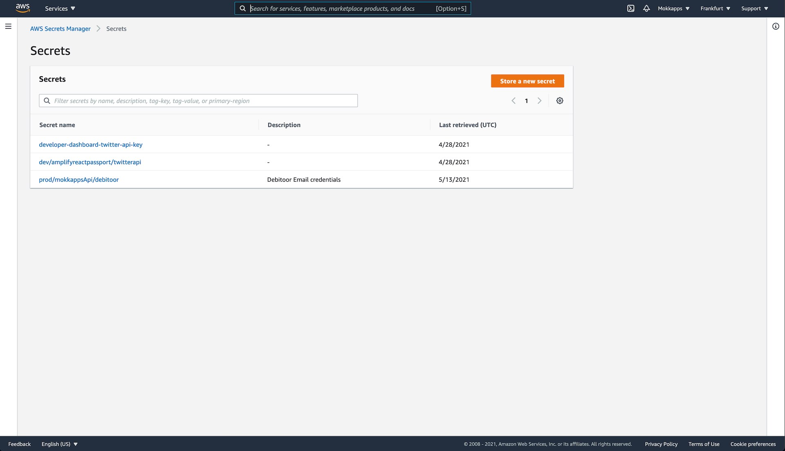
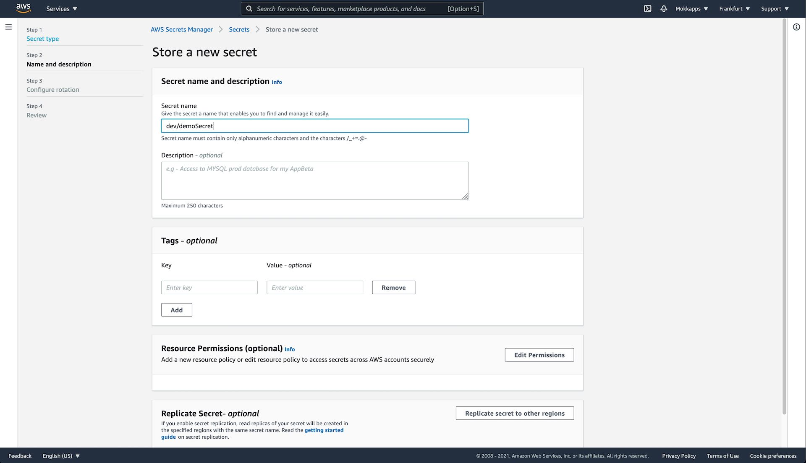
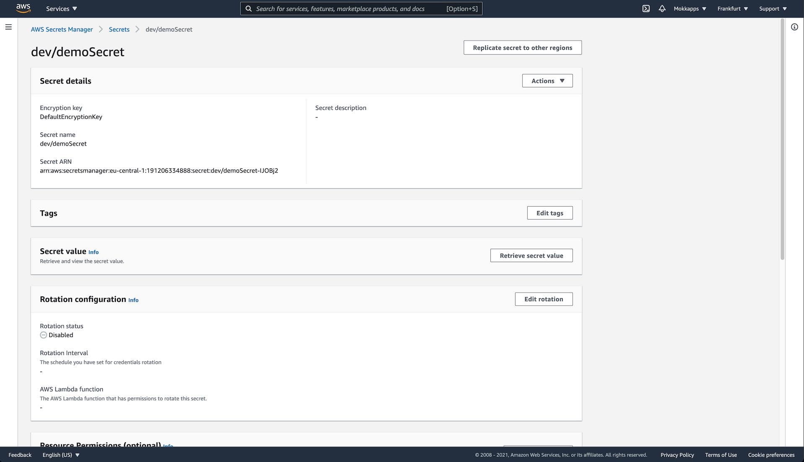

The [twelve-factor app](https://12factor.net/) is a known methodology for building software-as-a-service apps. One factor describes
that an application's configuration should be stored in the environment and not in the code to enforce a strict separation of config from code.

In this article, I want to demonstrate how you can add sensitive and insensitive configuration data to an [AWS Amplify](https://aws.amazon.com/amplify/) backend using environment variables and [AWS Secrets Manager](https://aws.amazon.com/secrets-manager/).

## Table of Contents

* [Types of configuration](#types-of-configuration)
* [Init Amplify](#init-amplify)
* [Add insensitive configuration data](#add-insensitive-configuration-data)
* [Add sensitive data using AWS Secrets Manager](#add-sensitive-data-using-aws-secrets-manager)
* [Conclusion](#conclusion)

## Types of configuration

There exist many types of configuration data, for example:

* timeouts 
* connection strings
* external API configurations like URLs and endpoints
* caching
* hosting configuration for URL, port, or schema
* file system paths
* framework configuration
* libraries configuration
* business logic parameters
* and many more

Apart from the type, configuration data can also be categorized as sensitive or insensitive.

### Sensitive vs Insensitive

Sensitive configuration data is anything that can be potentially exploited by a third party and therefore must be protected from unauthorized
access. Examples of such sensitive data are API keys, usernames, passwords, emails, etc. This data should not be part of your version control. Insensitive configuration data is for example a timeout string for a backend endpoint that can be safely added to the version control.

## Init Amplify

[[info]]
| You need an AWS account and the Amplify CLI installed and configured to be able to follow the following steps. [Check out the official docs](https://docs.amplify.aws/start/getting-started/installation/q/integration/js) to set up the prerequisites.

Let's start by creating a new Amplify project:

```shell
mkdir amplify-env-config-demo
cd amplify-env-config-demo

▶ amplify init
? Enter a name for the project amplifyenvconfigdemo
? Initialize the project with the above configuration? Yes
? Select the authentication method you want to use: AWS profile
? Please choose the profile you want to use default
```

Next, we can add an API which we will use to add some environment configuration.

```shell
▶ amplify add api
? Please select from one of the below mentioned services: REST
? Provide a friendly name for your resource to be used as a label for this category in the project: amplifyenvconfigdemoapi
? Provide a path (e.g., /book/{isbn}): /handle
? Choose a Lambda source Create a new Lambda function
? Provide an AWS Lambda function name: amplifyenvconfigdemofunction
? Choose the runtime that you want to use: NodeJS
? Choose the function template that you want to use: Hello World
? Do you want to configure advanced settings? No
? Do you want to edit the local lambda function now? No
? Restrict API access No
? Do you want to add another path? No
```

We create a simple [Node.js](https://nodejs.org/) lambda function based on the "Hello World" Amplify template. It will provide a REST API with an endpoint at the path `/handle`.

Amplify CLI generated the "Hello World" function code at `amplify/backend/function/amplifyenvconfigdemofunction/src/index.js`:

```javascript
exports.handler = async event => {
  // TODO implement
  const response = {
    statusCode: 200,
    //  Uncomment below to enable CORS requests
    //  headers: {
    //      "Access-Control-Allow-Origin": "*",
    //      "Access-Control-Allow-Headers": "*"
    //  },
    body: JSON.stringify('Hello from Lambda!'),
  };
  return response;
};
```

## Add insensitive configuration data

As we now have a running API, we can add some insensitive configuration data as environment variables to our Amplify backend.

Therefore, we need to modify the `amplify/backend/function/amplifyenvconfigdemofunction/amplifyenvconfigdemofunction-cloudformation-template.json` file. It includes a `Parameters` object where we can add a new environment variable. In our case we want to add a string variable that can be accessed with the key `MyEnvVariableKey` and has the value `my-environment-variable`:

```json
{
  "AWSTemplateFormatVersion": "2010-09-09",
  "Description": "Lambda Function resource stack creation using Amplify CLI",
  "Parameters" : {
    ...
    "env": {
      "Type": "String"
    },
    "s3Key": {
      "Type": "String"
    },
    // highlight-start
    "MyEnvVariableKey" : {
      "Type" : "String",
      "Default" : "my-environment-variable"
    }
    // highlight-end
  },
  ...
}
```

We also need to modify the `Resources > Environment > Variables` object in this file to be able to map our new environment key to a variable that is attached to
the global `process.env` variable and is injected by the Node.js runtime:

```json
{
  "Resources": {
    "Environment": {
      "Variables": {
        "ENV": {
          "Ref": "env"
        },
        "REGION": {
          "Ref": "AWS::Region"
        },
        // highlight-start
        "MY_ENV_VAR": {
          "Ref": "MyEnvVariableKey"
        }
        // highlight-end
      }
    }  
  }
}
```

Finally, we need to run `amplify push` to build all of our local backend resources and provision them in the cloud.

Now we can access this variable in our lambda function by accessing the global `process.env` variable:

```javascript
exports.handler = async event => {
  // highlight-next-line
  console.log('MY_ENV_VAR', process.env.MY_ENV_VAR);

  const response = {
    statusCode: 200,
    body: JSON.stringify('Hello from Lambda!'),
  };
  return response;
};
```

## Add sensitive data using AWS Secrets Manager

AWS provides the [AWS Secrets Manager](https://aws.amazon.com/secrets-manager/) that helps to "protect secrets needed to access your applications, services, and IT resources". We will use this service to be able to access sensitive data from our backend.

First, we need to click on "Store a new secret" to create a new secret:



Next, we click "Other type of secret" and enter key and value of our secret in the corresponding "Secret key/value" inputs:


It is possible to add multiple key/value pairs to a secret. A new pair can be added by clicking the "+ Add row" button.

In the next screen we need to add a name and some other optional information to our secret:



Let's finish the wizard by skipping all the following screens by clicking the "Next" button.

Now we can open the secret and inspect its values inside the AWS Secrets Manager:



We need to copy the "Secret ARN" value as we need to add a new configuration object in our Cloudformation configuration file `amplifyenvconfigdemofunction-cloudformation-template.json`:

```json
"lambdaexecutionpolicy": {
  "DependsOn": ["LambdaExecutionRole"],
  "Type": "AWS::IAM::Policy",
  "Properties": {
  "PolicyName": "lambda-execution-policy",
  "Roles": [{ "Ref": "LambdaExecutionRole" }],
  "PolicyDocument": {
    "Version": "2012-10-17",
    "Statement": [
        // highlight-start
        {
          "Effect": "Allow",
          "Action": ["secretsmanager:GetSecretValue"],
          "Resource": {
            "Fn::Sub": [
              "arn:aws:secretsmanager:${region}:${account}:secret:key_id",
              { 
                "region": {
                  "Ref": "AWS::Region"
                },
                "account": {
                  "Ref": "AWS::AccountId"
                }
              }
            ]
          }
        }
        // highlight-end
      ]
    }
  }
}

```

Again, we need to run `amplify push` to build all of our local backend resources and provision them in the cloud.

Now we need to add some JavaScript code to be able to access the secret inside our Node.js lambda function.

First, we need to add the AWS SDK to `amplify/backend/function/amplifyenvconfigdemofunction/src/package.json` by running:

```shell
npm install aws-sdk
```

Then we can use the `SecretsManager` to get our secret values by passing the "Secret name" which we defined in the AWS Secrets Manager:

```javascript
// highlight-start
const AWS = require('aws-sdk');
const secretsManager = new AWS.SecretsManager();
// highlight-end

exports.handler = async event => {
  console.log('MY_ENV_VAR', process.env.MY_ENV_VAR);

  // highlight-start
  const secretData = await secretsManager
    .getSecretValue({ SecretId: 'dev/demoSecret' })
    .promise();
  const secretValues = JSON.parse(secretData.SecretString);

  console.log('DEMO_API_KEY', secretValues.DEMO_API_KEY);
  // highlight-end

  const response = {
    statusCode: 200,
    body: JSON.stringify('Hello from Lambda!'),
  };
  return response;
};
```

## Conclusion
In this article, I demonstrated how you can add sensitive and insensitive environment configuration to your AWS Amplify backend. You can also watch [this video from Nader Dabit](https://www.youtube.com/watch?v=T3vy3ksa4oc) if you prefer a visual tutorial.

If you liked this article, follow me on [Twitter](https://twitter.com/mokkapps) to get notified about new blog posts and more content from me. 
